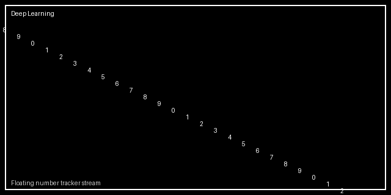
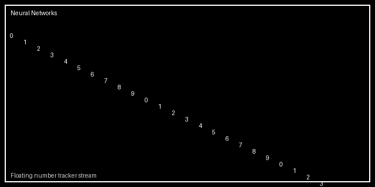

# Forward Deployment Engineer | Gen AI | ML | Data

  
  

---

## Profile Objects

| Object | What I Deliver |
|:--|:--|
| **Data** | Data acquisition, quality, modeling, and domain-aware analytics |
| **Compute** | Reliable pipelines, scalable processing, and production performance |
| **Technology** | End-to-end systems using Gen AI, ML, APIs, and cloud workflows |

## Domain Positioning

I work as a **Forward Deployment Engineer** across domains, translating research and business constraints into deployed AI/ML/data systems with measurable outcomes.

---

## Dynamic Repository Intelligence

This dashboard is generated from live GitHub API data and refreshed automatically.

<!-- AUTO-STATS:START -->

 

| Metric | Live Value |
|:--|--:|
| Public Repositories | 20 |
| Non-Fork Projects | 20 |
| Total Stars | 1 |
| Total Forks | 0 |
| Total Watchers | 1 |
| Open Issues Across Projects | 3 |
| Open Pull Requests Tracker | 3 |
| Top Languages by Repo Count | Python (10), R (2), C++ (2), Jupyter Notebook (1), TeX (1), MATLAB (1) |
| Domain Signals | Gen AI (0), ML (1), Data (1), Deployment (0) |

#### Most Starred Repositories

| Repository | Stars | Last Push |
|:--|--:|:--|
| [Manifold-DB-Repo](https://github.com/twomathematicians-code/Manifold-DB-Repo) | 1 | 2026-06-02 |
| [twomathematicians-code](https://github.com/twomathematicians-code/twomathematicians-code) | 0 | 2026-07-18 |
| [mahesh-portfolio](https://github.com/twomathematicians-code/mahesh-portfolio) | 0 | 2026-07-15 |
| [chen](https://github.com/twomathematicians-code/chen) | 0 | 2026-07-15 |
| [CDL-Monograph-Markdown](https://github.com/twomathematicians-code/CDL-Monograph-Markdown) | 0 | 2026-07-13 |

#### Latest Updated Repositories

| Repository | Primary Language | Last Push |
|:--|:--|:--|
| [twomathematicians-code](https://github.com/twomathematicians-code/twomathematicians-code) | Python | 2026-07-18 |
| [mahesh-portfolio](https://github.com/twomathematicians-code/mahesh-portfolio) | Jupyter Notebook | 2026-07-15 |
| [chen](https://github.com/twomathematicians-code/chen) | Python | 2026-07-15 |
| [CDL-Monograph-Markdown](https://github.com/twomathematicians-code/CDL-Monograph-Markdown) | TeX | 2026-07-13 |
| [post-quantum-computations](https://github.com/twomathematicians-code/post-quantum-computations) | Python | 2026-06-20 |

> Last auto-sync: **2026-07-18 13:27 UTC**

#### Deep Learning & Neural Networks Number Streams

 

> Powered by `/scripts/update_profile_readme.py` and GitHub Actions for @twomathematicians-code.
<!-- AUTO-STATS:END -->

---

## Connect

- GitHub: https://github.com/twomathematicians-code
- LinkedIn: https://www.linkedin.com/in/mahesh-solanki-16b9a6a5/
- Email: twomathematicians@gmail.com
