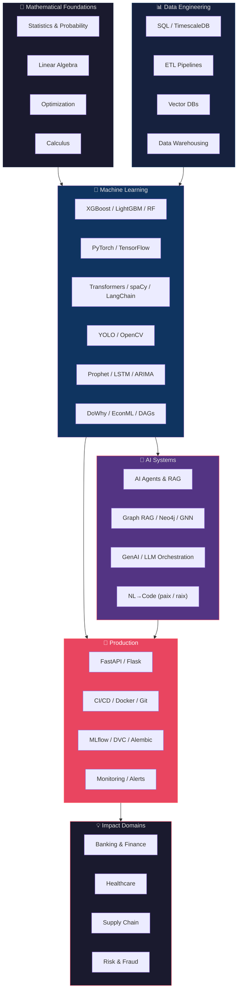

  

  
  
  
  

---

  

  

---

## 🧠 Unified Intelligence Architecture

```mermaid
flowchart TB
    subgraph FOUNDATIONS["📐 Mathematical Foundations"]
        STAT["Statistics & Probability"]
        LA["Linear Algebra"]
        OPT["Optimization"]
        CALC["Calculus"]
    end

    subgraph DATA["📊 Data Engineering"]
        SQL["SQL / TimescaleDB"]
        PIPES["ETL Pipelines"]
        VECTOR["Vector DBs"]
        WAREHOUSE["Data Warehousing"]
    end

    subgraph ML["🤖 Machine Learning"]
        CLASSIC["XGBoost / LightGBM / RF"]
        DL["PyTorch / TensorFlow"]
        NLP["Transformers / spaCy / LangChain"]
        CV["YOLO / OpenCV"]
        TS["Prophet / LSTM / ARIMA"]
        CAUSAL["DoWhy / EconML / DAGs"]
    end

    subgraph AI["🧬 AI Systems"]
        AGENT["AI Agents & RAG"]
        GRAPH["Graph RAG / Neo4j / GNN"]
        GENAI["GenAI / LLM Orchestration"]
        CODEGEN["NL→Code (paix / raix)"]
    end

    subgraph PROD["🚀 Production"]
        API["FastAPI / Flask"]
        CICD["CI/CD / Docker / Git"]
        MLOPS["MLflow / DVC / Alembic"]
        MONITOR["Monitoring / Alerts"]
    end

    subgraph IMPACT["💡 Impact Domains"]
        FSI["Banking & Finance"]
        HEALTH["Healthcare"]
        SUPPLY["Supply Chain"]
        RISK["Risk & Fraud"]
    end

    FOUNDATIONS --> ML
    DATA --> ML
    ML --> AI
    ML --> PROD
    AI --> PROD
    PROD --> IMPACT

    style FOUNDATIONS fill:#1a1a2e,stroke:#16213e,color:#e0e0e0
    style DATA fill:#16213e,stroke:#0f3460,color:#e0e0e0
    style ML fill:#0f3460,stroke:#533483,color:#e0e0e0
    style AI fill:#533483,stroke:#e94560,color:#e0e0e0
    style PROD fill:#e94560,stroke:#ff6b6b,color:#fff
    style IMPACT fill:#1a1a2e,stroke:#e94560,color:#e0e0e0
```

  
  

  

  

---

  

<i>math, models &amp; learning in motion</i>

  

<table align="center">
<tr>
<td width="33%" align="center">
  <b>perceptron</b> 
  
</td>
<td width="33%" align="center">
  <b>neural network — forward pass</b> 
  
</td>
<td width="33%" align="center">
  <b>backpropagation</b> 
  
</td>
</tr>
<tr>
<td width="33%" align="center">
  <b>training loss</b> 
  
</td>
<td width="33%" align="center">
  <b>decision boundary</b> 
  
</td>
<td width="33%" align="center">
  <b>distribution</b> 
  
</td>
</tr>
</table>

  <b>large language model — attention</b> 
  

---

  

   
  

   
  

   
  

---

  

<table align="center">
<tr>
<td width="50%">
  <h3 align="center">
    <a href="https://github.com/twomathematicians-code/archon">
      🏗️ Archon — AI/ML Meta-Platform
    </a>
  </h3>
  
YAML/DSL-driven compiler for AI intent. 6-layer architecture: data → models → pipelines → policies.

</td>
<td width="50%">
  <h3 align="center">
    <a href="https://github.com/twomathematicians-code/raix">
      ⚡ raix — R + AI + eXperience
    </a>
  </h3>
  

    
    
  

  
AI coding assistant for RStudio — chat, debug, generate code, run Python, compile C++, simulate.

</td>
</tr>
<tr>
<td width="50%">
  <h3 align="center">
    <a href="https://github.com/twomathematicians-code/paix">
      🐍 paix — Python AI eXperimental
    </a>
  </h3>
  
Natural language → Python code. OpenAI/Anthropic/Ollama. Code gen + execution + file loading.

</td>
<td width="50%">
  <h3 align="center">
    <a href="https://github.com/twomathematicians-code/fingraph-sentinel">
      🔷 FinGraph Sentinel
    </a>
  </h3>
  
GenAI Graph Engineering Agent — Neo4j · Graph RAG · GNN · AML · KYC

</td>
</tr>
</table>

---

## 📦 Full Portfolio

### AI/ML Infrastructure & Tools

| Project | Description |
|---|---|
| **[archon](https://github.com/twomathematicians-code/archon)** | AI/ML Meta-Platform: YAML/DSL-driven compiler for AI intent. 6-layer architecture: data → models → pipelines → policies. Code generation, guardrails, GenAI, causal ML. |
| **[raix](https://github.com/twomathematicians-code/raix)** | AI coding assistant for RStudio. Chat, explain, debug, generate code with any model — OpenAI, Ollama, Claude, Groq, Mistral, DeepSeek, and more. |
| **[paix](https://github.com/twomathematicians-code/paix)** | Python AI eXperimental — natural language to Python code. Multi-backend (OpenAI, Anthropic, Ollama). Code generation, execution, exercise mode, file loading with context injection. |

### ML Engineering & MLOps

| Project | Description |
|---|---|
| **[demand-forecasting](https://github.com/twomathematicians-code/demand-forecasting)** | Production-grade demand forecasting: Prophet + LightGBM + SARIMA ensemble (10% MAPE). 36-feature engineering, TimescaleDB, FastAPI, Docker-ready. |
| **[engineer-credit-risk](https://github.com/twomathematicians-code/engineer-credit-risk)** | End-to-end production ML pipeline: credit risk scoring with FastAPI, PostgreSQL, MLflow, DVC, Alembic migrations, CI/CD. 380+ lines of tests. |
| **[CausalInference-Toolkit](https://github.com/twomathematicians-code/CausalInference-Toolkit)** | Comprehensive causal inference framework: MSc-level statistical foundations + practical ML integration. DoWhy, EconML, DAGs, counterfactuals, A/B testing. |
| **[fraud-detection](https://github.com/twomathematicians-code/fraud-detection)** | Real-time fraud detection engine: XGBoost + Isolation Forest ensemble, Redis caching, SMOTE imbalance handling, sub-20ms transaction scoring. |

### NLP & Conversational AI

| Project | Description |
|---|---|
| **[nlp-toolkit](https://github.com/twomathematicians-code/nlp-toolkit)** | NLP microservices: NER, text summarization, keyword extraction, language detection, translation via spaCy and transformers. |
| **[chatbot-deployment](https://github.com/twomathematicians-code/chatbot-deployment)** | RAG conversational AI: LangChain, ChromaDB, Telegram + WhatsApp webhook connectors for production chatbot deployment. |
| **[sentiment-analysis-suite](https://github.com/twomathematicians-code/sentiment-analysis-suite)** | Multi-source sentiment analysis with emotion detection, aspect-based NLP, VADER + rule engine, batch processing. |

### Analytics & Business Intelligence

| Project | Description |
|---|---|
| **[customer-analytics](https://github.com/twomathematicians-code/customer-analytics)** | Customer churn prediction, RFM segmentation, CLV estimation with XGBoost + SHAP explainability. |
| **[recommender-systems](https://github.com/twomathematicians-code/recommender-systems)** | Hybrid recommender: collaborative filtering, content-based, FAISS vector search, A/B testing framework. |

### Domain-Specific ML

| Project | Description |
|---|---|
| **[fingraph-sentinel](https://github.com/twomathematicians-code/fingraph-sentinel)** | FinGraph Sentinel — GenAI Graph Engineering Agent for BFSI: Neo4j, Graph RAG, GNNs, AML, credit risk, insurance claims, KYC compliance. |
| **[healthcare-analytics](https://github.com/twomathematicians-code/healthcare-analytics)** | Healthcare diagnostics ML: heart disease, cancer, diabetes, pneumonia detection + survival analysis with HIPAA logging. |
| **[financial-forecasting](https://github.com/twomathematicians-code/financial-forecasting)** | Multi-model time series forecasting: LSTM, Prophet, ARIMA for stocks, crypto, commodities with WebSocket live streaming. |
| **[computer-vision](https://github.com/twomathematicians-code/computer-vision)** | Computer vision API: YOLO object detection, face recognition, image classification, landmark detection, segmentation. |

### Academic

| Project | Description |
|---|---|
| **[bartlett-correction-sem](https://github.com/twomathematicians-code/bartlett-correction-sem)** | A Bartlett correction for a likelihood ratio test in structural equation modeling — Master's thesis, Ghent University, supervised by Prof. Dr. Yves Rosseel. |

---

  
  
  
  
  

---

  

<!-- AUTO-STATS:START -->

 

| Metric | Live Value |
|:--|--:|
| Public Repositories | 32 |
| Non-Fork Projects | 32 |
| Total Stars | 1 |
| Total Forks | 0 |
| Total Watchers | 1 |
| Open Issues Across Projects | 5 |
| Open Pull Requests Tracker | 5 |
| Top Languages by Repo Count | Python (21), TeX (2), R (2), C++ (2), Jupyter Notebook (1), MATLAB (1) |
| Domain Signals | Gen AI (1), ML (5), Data (4), Deployment (2) |

#### Most Starred Repositories

| Repository | Stars | Last Push |
|:--|--:|:--|
| [Manifold-DB-Repo](https://github.com/twomathematicians-code/Manifold-DB-Repo) | 1 | 2026-06-02 |
| [twomathematicians-code](https://github.com/twomathematicians-code/twomathematicians-code) | 0 | 2026-07-30 |
| [recommender-systems](https://github.com/twomathematicians-code/recommender-systems) | 0 | 2026-07-29 |
| [nlp-toolkit](https://github.com/twomathematicians-code/nlp-toolkit) | 0 | 2026-07-29 |
| [healthcare-analytics](https://github.com/twomathematicians-code/healthcare-analytics) | 0 | 2026-07-29 |

#### Latest Updated Repositories

| Repository | Primary Language | Last Push |
|:--|:--|:--|
| [twomathematicians-code](https://github.com/twomathematicians-code/twomathematicians-code) | Python | 2026-07-30 |
| [recommender-systems](https://github.com/twomathematicians-code/recommender-systems) | Python | 2026-07-29 |
| [nlp-toolkit](https://github.com/twomathematicians-code/nlp-toolkit) | Python | 2026-07-29 |
| [healthcare-analytics](https://github.com/twomathematicians-code/healthcare-analytics) | Python | 2026-07-29 |
| [fraud-detection](https://github.com/twomathematicians-code/fraud-detection) | Python | 2026-07-29 |

> Last auto-sync: **2026-07-30 02:46 UTC**

---

  

  <samp>
    <a href="https://linkedin.com/in/maheshsolanki-16b9a6a5">linkedin</a>
    &nbsp;•&nbsp;
    <a href="mailto:maheshsinh1910@gmail.com">email</a>
    &nbsp;•&nbsp;
    <a href="https://github.com/twomathematicians-code">github</a>
  </samp>

