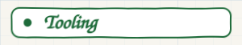

  

  
  
  
  

---

  

  

---

  

<i>math, models &amp; learning in motion</i>

  

<table align="center">
<tr>
<td width="33%" align="center">
  <b>perceptron</b> 
  
</td>
<td width="33%" align="center">
  <b>neural network — forward pass</b> 
  
</td>
<td width="33%" align="center">
  <b>backpropagation</b> 
  
</td>
</tr>
<tr>
<td width="33%" align="center">
  <b>training loss</b> 
  
</td>
<td width="33%" align="center">
  <b>decision boundary</b> 
  
</td>
<td width="33%" align="center">
  <b>distribution</b> 
  
</td>
</tr>
</table>

  <b>large language model — attention</b> 
  

---

  

   
  

   
  

   
  

---

  

<table align="center">
<tr>
<td width="50%">
  <h3 align="center">
    <a href="https://github.com/twomathematicians-code/engineer-credit-risk">
      🏦 Credit Risk Pipeline
    </a>
  </h3>
  
End-to-end MLOps — FastAPI • PostgreSQL • MLflow • DVC • Alembic • 380+ lines of tests

</td>
<td width="50%">
  <h3 align="center">
    <a href="https://github.com/twomathematicians-code/fraud-detection">
      🛡️ Fraud Detection Engine
    </a>
  </h3>
  
Real-time scoring — XGBoost + Isolation Forest • Redis • SMOTE • &lt;20ms latency

</td>
</tr>
<tr>
<td width="50%">
  <h3 align="center">
    <a href="https://github.com/twomathematicians-code/chatbot-deployment">
      🤖 Chatbot + RAG Platform
    </a>
  </h3>
  
LangChain • ChromaDB • Telegram & WhatsApp webhooks • Intent classification

</td>
<td width="50%">
  <h3 align="center">
    <a href="https://github.com/twomathematicians-code/computer-vision">
      👁️ Computer Vision API
    </a>
  </h3>
  
YOLO detection • Face recognition • Classification • Segmentation • OpenCV

</td>
</tr>
<tr>
<td width="100%" colspan="2">
  <h3 align="center">
    <a href="https://github.com/twomathematicians-code/fingraph-sentinel">
      🔷 FinGraph Sentinel — Graph Engineering + GenAI Agent
    </a>
  </h3>
  

    
    
    
    
  

  
Neo4j · LangChain · Graph RAG · GNN · AML · credit risk · insurance claims · KYC

</td>
</tr>
</table>

<b>🧠 ML Portfolio — 11 Production repos</b>

 
<table>
<tr>
  <td width="33%"><a href="https://github.com/twomathematicians-code/financial-forecasting"><b>📈 Financial Forecasting</b></a> LSTM • Prophet • WebSocket streaming</td>
  <td width="33%"><a href="https://github.com/twomathematicians-code/customer-analytics"><b>👥 Customer Analytics</b></a> Churn • RFM • SHAP • CLV</td>
  <td width="33%"><a href="https://github.com/twomathematicians-code/sentiment-analysis-suite"><b>💬 Sentiment Suite</b></a> Emotions • Aspect-based • NLP</td>
</tr>
<tr>
  <td><a href="https://github.com/twomathematicians-code/recommender-systems"><b>🎯 Recommender Systems</b></a> FAISS • Hybrid • A/B testing</td>
  <td><a href="https://github.com/twomathematicians-code/nlp-toolkit"><b>🧠 NLP Toolkit</b></a> NER • Summarize • Translate</td>
  <td><a href="https://github.com/twomathematicians-code/healthcare-analytics"><b>🏥 Healthcare ML</b></a> Heart • Cancer • HIPAA</td>
</tr>
<tr>
  <td colspan="3"><a href="https://github.com/twomathematicians-code/fingraph-sentinel"><b>🔷 FinGraph Sentinel</b></a> — Neo4j · Graph RAG · GNN · LangChain Agent · AML/Credit/Insurance/KYC</td>
</tr>
<tr>
  <td colspan="3"><a href="https://github.com/twomathematicians-code/demand-forecasting"><b>📊 Demand Forecasting</b></a> — Supply chain: LightGBM + Prophet + SARIMA</td>
</tr>
</table>

<b>🔭 Other Projects</b>

 
<table>
<tr>
  <td width="33%"><a href="https://github.com/twomathematicians-code/mantis_optimization"><b>Hybrid AI Optimizer</b></a> TypeScript • Next.js • Ollama</td>
  <td width="33%"><a href="https://github.com/twomathematicians-code/EcoDrive-Net_finalized"><b>EcoDrive-Net ADAS</b></a> MATLAB • Deep Learning • ADAS</td>
  <td width="33%"><a href="https://github.com/twomathematicians-code/bartlett-correction-sem"><b>Bartlett Correction</b></a> R • Statistics • SEM</td>
</tr>
<tr>
  <td><a href="https://github.com/twomathematicians-code/chen"><b>CHEN Theory</b></a> Python • Distributed AI • Research</td>
  <td><a href="https://github.com/twomathematicians-code/post-quantum-computations"><b>Post-Quantum Crypto</b></a> Python • Cryptography</td>
  <td><a href="https://github.com/twomathematicians-code/maisuclaw"><b>MAISUCLAW</b></a> Python • LLM Swarm</td>
</tr>
</table>

---

  

<!-- AUTO-STATS:START -->

 

| Metric | Live Value |
|:--|--:|
| Public Repositories | 32 |
| Non-Fork Projects | 32 |
| Total Stars | 1 |
| Total Forks | 0 |
| Total Watchers | 1 |
| Open Issues Across Projects | 5 |
| Open Pull Requests Tracker | 5 |
| Top Languages by Repo Count | Python (21), TeX (2), R (2), C++ (2), Jupyter Notebook (1), MATLAB (1) |
| Domain Signals | Gen AI (1), ML (5), Data (4), Deployment (2) |

#### Most Starred Repositories

| Repository | Stars | Last Push |
|:--|--:|:--|
| [Manifold-DB-Repo](https://github.com/twomathematicians-code/Manifold-DB-Repo) | 1 | 2026-06-02 |
| [twomathematicians-code](https://github.com/twomathematicians-code/twomathematicians-code) | 0 | 2026-07-30 |
| [recommender-systems](https://github.com/twomathematicians-code/recommender-systems) | 0 | 2026-07-29 |
| [nlp-toolkit](https://github.com/twomathematicians-code/nlp-toolkit) | 0 | 2026-07-29 |
| [healthcare-analytics](https://github.com/twomathematicians-code/healthcare-analytics) | 0 | 2026-07-29 |

#### Latest Updated Repositories

| Repository | Primary Language | Last Push |
|:--|:--|:--|
| [twomathematicians-code](https://github.com/twomathematicians-code/twomathematicians-code) | Python | 2026-07-30 |
| [recommender-systems](https://github.com/twomathematicians-code/recommender-systems) | Python | 2026-07-29 |
| [nlp-toolkit](https://github.com/twomathematicians-code/nlp-toolkit) | Python | 2026-07-29 |
| [healthcare-analytics](https://github.com/twomathematicians-code/healthcare-analytics) | Python | 2026-07-29 |
| [fraud-detection](https://github.com/twomathematicians-code/fraud-detection) | Python | 2026-07-29 |

> Last auto-sync: **2026-07-30 02:46 UTC**

---

  

  <samp>
    <a href="https://linkedin.com/in/maheshsolanki-16b9a6a5">linkedin</a>
    &nbsp;•&nbsp;
    <a href="mailto:maheshsinh1910@gmail.com">email</a>
    &nbsp;•&nbsp;
    <a href="https://github.com/twomathematicians-code">github</a>
  </samp>

