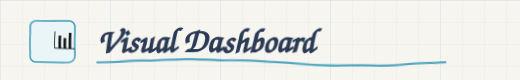
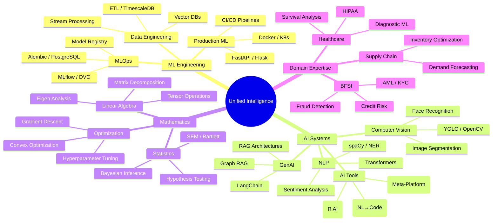
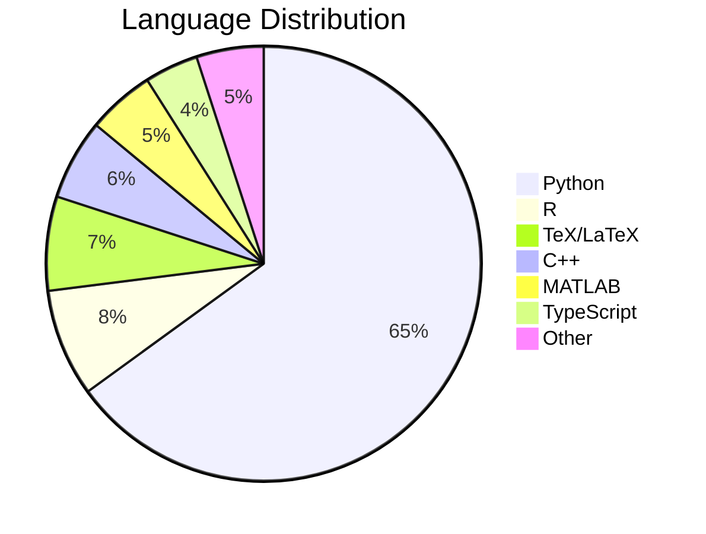
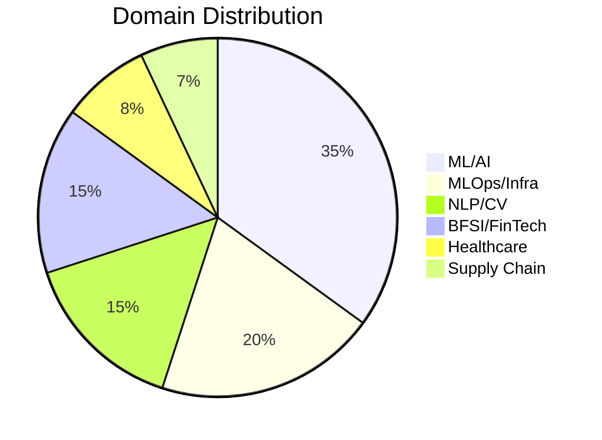
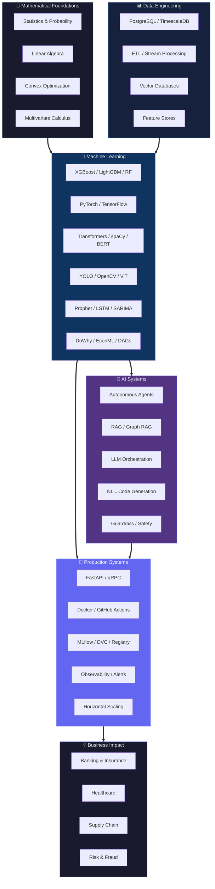
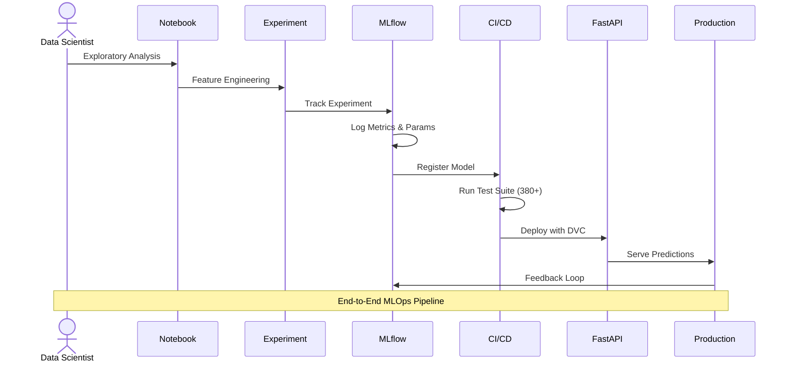
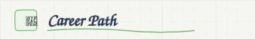
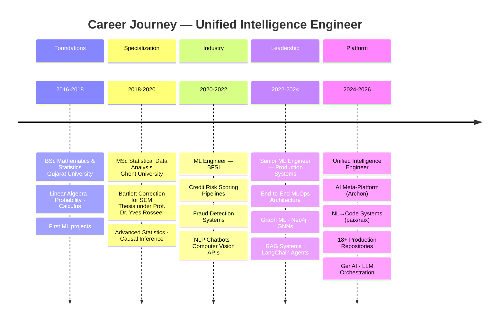
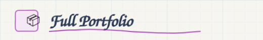
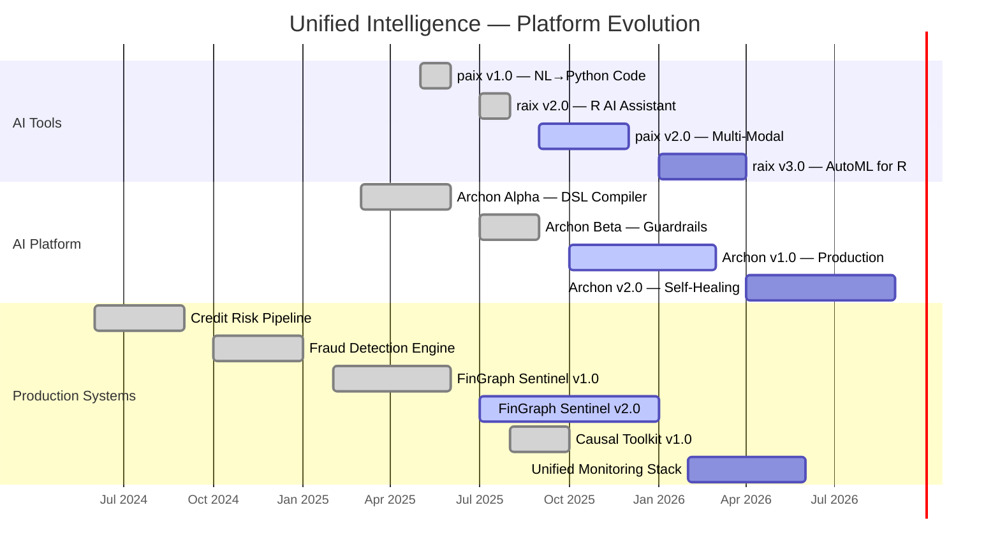

  <picture>
    <source media="(prefers-color-scheme: dark)" srcset="assets/banner.svg" />
    <source media="(prefers-color-scheme: light)" srcset="assets/banner.svg" />
    
  </picture>

  

  
  
  
  

---

  

  

---

  

<table align="center">
<tr>
<td colspan="2">

### 🧠 Unified Intelligence Mindmap

```mermaid
mindmap
  root((Unified Intelligence))
    ML Engineering
      Production ML
        FastAPI / Flask
        Docker / K8s
        CI/CD Pipelines
      MLOps
        MLflow / DVC
        Model Registry
        Alembic / PostgreSQL
      Data Engineering
        ETL / TimescaleDB
        Vector DBs
        Stream Processing
    AI Systems
      GenAI
        LangChain
        RAG Architectures
        Graph RAG
      NLP
        Transformers
        spaCy / NER
        Sentiment Analysis
      Computer Vision
        YOLO / OpenCV
        Face Recognition
        Image Segmentation
      AI Tools
        paix (NL→Code)
        raix (R AI)
        Archon (Meta-Platform)
    Mathematics
      Statistics
        Bayesian Inference
        Hypothesis Testing
        SEM / Bartlett
      Optimization
        Gradient Descent
        Convex Optimization
        Hyperparameter Tuning
      Linear Algebra
        Matrix Decomposition
        Eigen Analysis
        Tensor Operations
    Domain Expertise
      BFSI
        Credit Risk
        Fraud Detection
        AML / KYC
      Healthcare
        Diagnostic ML
        Survival Analysis
        HIPAA
      Supply Chain
        Demand Forecasting
        Inventory Optimization
```
</td>
</tr>
</table>

  
  

<table align="center">
<tr>
<td width="50%">

```mermaid
pie title Language Distribution
  "Python" : 65
  "R" : 8
  "TeX/LaTeX" : 7
  "C++" : 6
  "MATLAB" : 5
  "TypeScript" : 4
  "Other" : 5
```
</td>
<td width="50%">

```mermaid
pie title Domain Distribution
  "ML/AI" : 35
  "MLOps/Infra" : 20
  "NLP/CV" : 15
  "BFSI/FinTech" : 15
  "Healthcare" : 8
  "Supply Chain" : 7
```
</td>
</tr>
</table>

  

  

---

## 🧠 Unified Intelligence Architecture

```mermaid
flowchart TB
    subgraph FOUNDATIONS["📐 Mathematical Foundations"]
        direction LR
        STAT["Statistics & Probability"]
        LA["Linear Algebra"]
        OPT["Convex Optimization"]
        CALC["Multivariate Calculus"]
    end

    subgraph DATA["📊 Data Engineering"]
        direction LR
        SQL["PostgreSQL / TimescaleDB"]
        PIPES["ETL / Stream Processing"]
        VECTOR["Vector Databases"]
        WAREHOUSE["Feature Stores"]
    end

    subgraph ML["🤖 Machine Learning"]
        direction LR
        CLASSIC["XGBoost / LightGBM / RF"]
        DL["PyTorch / TensorFlow"]
        NLP["Transformers / spaCy / BERT"]
        CV["YOLO / OpenCV / ViT"]
        TS["Prophet / LSTM / SARIMA"]
        CAUSAL["DoWhy / EconML / DAGs"]
    end

    subgraph AI["🧬 AI Systems"]
        direction LR
        AGENT["Autonomous Agents"]
        RAG["RAG / Graph RAG"]
        LLM["LLM Orchestration"]
        CODEGEN["NL→Code Generation"]
        GUARD["Guardrails / Safety"]
    end

    subgraph PROD["🚀 Production Systems"]
        direction LR
        API["FastAPI / gRPC"]
        CICD["Docker / GitHub Actions"]
        MLOPS["MLflow / DVC / Registry"]
        MONITOR["Observability / Alerts"]
        SCALE["Horizontal Scaling"]
    end

    subgraph IMPACT["💡 Business Impact"]
        direction LR
        FSI["Banking & Insurance"]
        HEALTH["Healthcare"]
        SUPPLY["Supply Chain"]
        RISK["Risk & Fraud"]
    end

    FOUNDATIONS ==> ML
    DATA ==> ML
    ML ==> AI
    ML ==> PROD
    AI ==> PROD
    PROD ==> IMPACT

    style FOUNDATIONS fill:#1a1a2e,stroke:#16213e,color:#e0e0e0
    style DATA fill:#16213e,stroke:#0f3460,color:#e0e0e0
    style ML fill:#0f3460,stroke:#533483,color:#e0e0e0
    style AI fill:#533483,stroke:#6366F1,color:#e0e0e0
    style PROD fill:#6366F1,stroke:#818cf8,color:#fff
    style IMPACT fill:#1a1a2e,stroke:#6366F1,color:#e0e0e0
```

### 🔄 Typical ML Pipeline — From Research to Production

```mermaid
sequenceDiagram
    actor DS as Data Scientist
    participant NB as Notebook
    participant EXP as Experiment
    participant MLF as MLflow
    participant CD as CI/CD
    participant API as FastAPI
    participant PROD as Production

    DS->>NB: Exploratory Analysis
    NB->>EXP: Feature Engineering
    EXP->>MLF: Track Experiment
    MLF->>MLF: Log Metrics & Params
    MLF->>CD: Register Model
    CD->>CD: Run Test Suite (380+)
    CD->>API: Deploy with DVC
    API->>PROD: Serve Predictions
    PROD->>MLF: Feedback Loop
    Note over DS,PROD: End-to-End MLOps Pipeline
```

---

  

<i>math, models &amp; learning in motion</i>

  

<table align="center">
<tr>
<td width="33%" align="center">
  <b>perceptron</b> 
  
</td>
<td width="33%" align="center">
  <b>neural network — forward pass</b> 
  
</td>
<td width="33%" align="center">
  <b>backpropagation</b> 
  
</td>
</tr>
<tr>
<td width="33%" align="center">
  <b>training loss</b> 
  
</td>
<td width="33%" align="center">
  <b>decision boundary</b> 
  
</td>
<td width="33%" align="center">
  <b>distribution</b> 
  
</td>
</tr>
</table>

  <b>large language model — attention mechanism</b> 
  

---

  

### 💻 Core Engineering

| Category | Technologies |
|---|---|
| **Languages** |     |
| **Backend** |     |
| **Infrastructure** |     |
| **Streaming** |   |

### 🧠 Machine Learning & AI

| Category | Technologies |
|---|---|
| **Frameworks** |    |
| **NLP** |    |
| **Computer Vision** |    |
| **Time Series** |    |
| **Causal** |    |

### ⚙️ MLOps & Tooling

| Category | Technologies |
|---|---|
| **Experiment** |    |
| **CI/CD** |  |
| **Databases** |    |
| **Editors** |   |
| **Docs** |   |

---

## 🎯 Skills Matrix

<table>
<tr align="center">
  <td></td>
  <td><b>Novice</b></td>
  <td><b>Proficient</b></td>
  <td><b>Advanced</b></td>
  <td><b>Expert</b></td>
  <td><b>Master</b></td>
</tr>
<tr align="center">
  <td><b>Python</b></td>
  <td></td><td></td><td></td><td></td>
  <td bgcolor="#6366F1">⬛</td>
</tr>
<tr align="center">
  <td><b>ML/DL</b></td>
  <td></td><td></td><td></td><td></td>
  <td bgcolor="#6366F1">⬛</td>
</tr>
<tr align="center">
  <td><b>FastAPI</b></td>
  <td></td><td></td><td></td>
  <td bgcolor="#8B5CF6">⬛</td><td></td>
</tr>
<tr align="center">
  <td><b>Docker/CI</b></td>
  <td></td><td></td><td></td>
  <td bgcolor="#8B5CF6">⬛</td><td></td>
</tr>
<tr align="center">
  <td><b>PostgreSQL</b></td>
  <td></td><td></td><td></td>
  <td bgcolor="#8B5CF6">⬛</td><td></td>
</tr>
<tr align="center">
  <td><b>R</b></td>
  <td></td><td></td>
  <td bgcolor="#0EA5E9">⬛</td><td></td><td></td>
</tr>
<tr align="center">
  <td><b>Neo4j/GNN</b></td>
  <td></td><td></td>
  <td bgcolor="#0EA5E9">⬛</td><td></td><td></td>
</tr>
<tr align="center">
  <td><b>Statistics</b></td>
  <td></td><td></td><td></td><td></td>
  <td bgcolor="#6366F1">⬛</td>
</tr>
<tr align="center">
  <td><b>Computer Vision</b></td>
  <td></td><td></td>
  <td bgcolor="#0EA5E9">⬛</td><td></td><td></td>
</tr>
<tr align="center">
  <td><b>NLP</b></td>
  <td></td><td></td><td></td>
  <td bgcolor="#8B5CF6">⬛</td><td></td>
</tr>
<tr align="center">
  <td><b>C++</b></td>
  <td></td>
  <td bgcolor="#22C55E">⬛</td><td></td><td></td><td></td>
</tr>
<tr align="center">
  <td><b>MATLAB</b></td>
  <td></td><td></td>
  <td bgcolor="#0EA5E9">⬛</td><td></td><td></td>
</tr>
<tr align="center">
  <td><b>TypeScript</b></td>
  <td></td>
  <td bgcolor="#22C55E">⬛</td><td></td><td></td><td></td>
</tr>
</table>

> **Master** = Production-grade systems · **Expert** = Lead architect · **Advanced** = Independent delivery · **Proficient** = Solid working knowledge · **Novice** = Learning

---

  

```mermaid
timeline
    title Career Journey — Unified Intelligence Engineer
    section Foundations
      2016-2018 : BSc Mathematics & Statistics<br>Gujarat University
                : Linear Algebra · Probability · Calculus
                : First ML projects
    section Specialization
      2018-2020 : MSc Statistical Data Analysis<br>Ghent University
                : Bartlett Correction for SEM<br>Thesis under Prof. Dr. Yves Rosseel
                : Advanced Statistics · Causal Inference
    section Industry
      2020-2022 : ML Engineer — BFSI
                : Credit Risk Scoring Pipelines
                : Fraud Detection Systems
                : NLP Chatbots · Computer Vision APIs
    section Leadership
      2022-2024 : Senior ML Engineer — Production Systems
                : End-to-End MLOps Architecture
                : Graph ML · Neo4j · GNNs
                : RAG Systems · LangChain Agents
    section Platform
      2024-2026 : Unified Intelligence Engineer
                : AI Meta-Platform (Archon)
                : NL→Code Systems (paix/raix)
                : 18+ Production Repositories
                : GenAI · LLM Orchestration
```

---

  

<!-- PINNED REPOS -->

  
  

  
  

---

## 🏭 Featured Builds

<table align="center">
<tr>
<td width="50%">
  <h3 align="center">
    <a href="https://github.com/twomathematicians-code/engineer-credit-risk">🏦 Credit Risk Pipeline</a>
  </h3>
  

    
    
    
    
  

  
End-to-end MLOps: model training → registry → CI/CD → deployment. PostgreSQL + Alembic migrations.

</td>
<td width="50%">
  <h3 align="center">
    <a href="https://github.com/twomathematicians-code/fraud-detection">🛡️ Fraud Detection Engine</a>
  </h3>
  

    
    
    
    
  

  
Real-time scoring engine. Isolation Forest ensemble. Sub-20ms per transaction.

</td>
</tr>
<tr>
<td width="50%">
  <h3 align="center">
    <a href="https://github.com/twomathematicians-code/CausalInference-Toolkit">🔬 Causal Inference Toolkit</a>
  </h3>
  

    
    
    
  

  
MSc-level causal ML framework. Counterfactuals, A/B testing, policy evaluation.

</td>
<td width="50%">
  <h3 align="center">
    <a href="https://github.com/twomathematicians-code/demand-forecasting">📊 Demand Forecasting</a>
  </h3>
  

    
    
    
  

  
Production forecasting ensemble. 36 features. TimescaleDB + FastAPI + Docker.

</td>
</tr>
</table>

---

  

### 🤖 AI/ML Infrastructure & Tools

| Project | Stack | Description |
|---|---|---|
| **[archon](https://github.com/twomathematicians-code/archon)** | YAML/DSL · Python · 6-layer | AI/ML Meta-Platform. Intent compiler, code generation, guardrails, GenAI, causal ML. |
| **[raix](https://github.com/twomathematicians-code/raix)** | R · 13+ AI backends · 42 fns | AI coding assistant for RStudio. Self-configuring dashboard. |
| **[paix](https://github.com/twomathematicians-code/paix)** | Python · OpenAI/Anthropic/Ollama | NL → executable Python. File loading, exercise mode, 75 tests. |

### 🏭 ML Engineering & MLOps

| Project | Stack | Highlights |
|---|---|---|
| **[demand-forecasting](https://github.com/twomathematicians-code/demand-forecasting)** | Prophet · LightGBM · SARIMA | 10% MAPE · 36 features · TimescaleDB · FastAPI |
| **[engineer-credit-risk](https://github.com/twomathematicians-code/engineer-credit-risk)** | FastAPI · MLflow · DVC · PostgreSQL | 380+ tests · CI/CD · Alembic · Model Registry |
| **[CausalInference-Toolkit](https://github.com/twomathematicians-code/CausalInference-Toolkit)** | DoWhy · EconML · DAGs | Counterfactuals · Policy evaluation · A/B testing |
| **[fraud-detection](https://github.com/twomathematicians-code/fraud-detection)** | XGBoost · Isolation Forest · Redis | &lt;20ms · SMOTE · Real-time scoring |

### 💬 NLP & Conversational AI

| Project | Stack | Description |
|---|---|---|
| **[nlp-toolkit](https://github.com/twomathematicians-code/nlp-toolkit)** | spaCy · Transformers · FastAPI | NER, summarization, keyword extraction, language detection, translation. |
| **[chatbot-deployment](https://github.com/twomathematicians-code/chatbot-deployment)** | LangChain · ChromaDB · RAG | RAG conversational AI with Telegram + WhatsApp webhooks. |
| **[sentiment-analysis-suite](https://github.com/twomathematicians-code/sentiment-analysis-suite)** | VADER · Transformers | Emotion detection, aspect-based NLP, batch processing. |

### 📊 Analytics & Business Intelligence

| Project | Stack | Description |
|---|---|---|
| **[customer-analytics](https://github.com/twomathematicians-code/customer-analytics)** | XGBoost · SHAP · RFM | Churn prediction, customer segmentation, CLV estimation. |
| **[recommender-systems](https://github.com/twomathematicians-code/recommender-systems)** | FAISS · Hybrid CF/CB · A/B | Collaborative filtering, content-based, vector search. |

### 🎯 Domain-Specific ML

| Project | Stack | Domain |
|---|---|---|
| **[fingraph-sentinel](https://github.com/twomathematicians-code/fingraph-sentinel)** | Neo4j · Graph RAG · GNN · LangChain | BFSI: AML · credit · insurance · KYC |
| **[healthcare-analytics](https://github.com/twomathematicians-code/healthcare-analytics)** | PyTorch · HIPAA logging | Heart · cancer · diabetes · pneumonia |
| **[financial-forecasting](https://github.com/twomathematicians-code/financial-forecasting)** | LSTM · Prophet · ARIMA · WebSocket | Stocks · crypto · commodities |
| **[computer-vision](https://github.com/twomathematicians-code/computer-vision)** | YOLO · OpenCV · FastAPI | Detection · face · segmentation · landmarks |

### 🎓 Academic & Research

| Project | Stack | Description |
|---|---|---|
| **[bartlett-correction-sem](https://github.com/twomathematicians-code/bartlett-correction-sem)** | R · SEM · lavaan | Bartlett correction for LRT in SEM. MSc thesis, Ghent University. |
| **[mantis_optimization](https://github.com/twomathematicians-code/mantis_optimization)** | TypeScript · Next.js · Ollama | Hybrid AI optimization inspired by mantis shrimp vision. |
| **[EcoDrive-Net_finalized](https://github.com/twomathematicians-code/EcoDrive-Net_finalized)** | MATLAB · Deep Learning | ADAS eco-driving simulation. |
| **[post-quantum-computations](https://github.com/twomathematicians-code/post-quantum-computations)** | Python · Cryptography | Post-quantum cryptography exploration. |
| **[chen](https://github.com/twomathematicians-code/chen)** | Python · Distributed AI | CHEN theory — distributed AI research. |

---

  

---

## 📈 Project Roadmap

```mermaid
gantt
    title Unified Intelligence — Platform Evolution
    dateFormat  YYYY-MM
    axisFormat  %b %Y
    section AI Tools
    paix v1.0 — NL→Python Code   :done, p1, 2025-05, 2025-06
    raix v2.0 — R AI Assistant   :done, p2, 2025-07, 2025-08
    paix v2.0 — Multi-Modal       :active, p3, 2025-09, 2025-12
    raix v3.0 — AutoML for R      :p4, 2026-01, 2026-04
    section AI Platform
    Archon Alpha — DSL Compiler   :done, a1, 2025-03, 2025-06
    Archon Beta — Guardrails      :done, a2, 2025-07, 2025-09
    Archon v1.0 — Production      :active, a3, 2025-10, 2026-03
    Archon v2.0 — Self-Healing    :a4, 2026-04, 2026-09
    section Production Systems
    Credit Risk Pipeline           :done, cr1, 2024-06, 2024-09
    Fraud Detection Engine         :done, cr2, 2024-10, 2025-01
    FinGraph Sentinel v1.0        :done, cr3, 2025-02, 2025-06
    FinGraph Sentinel v2.0        :active, cr4, 2025-07, 2026-01
    Causal Toolkit v1.0           :done, ct1, 2025-08, 2025-10
    Unified Monitoring Stack       :ct2, 2026-02, 2026-06
```

---

  
  
  
  
  

---

  

<!-- AUTO-STATS:START -->

 

| Metric | Live Value |
|:--|--:|
| Public Repositories | 32 |
| Non-Fork Projects | 32 |
| Total Stars | 1 |
| Total Forks | 0 |
| Total Watchers | 1 |
| Open Issues Across Projects | 5 |
| Open Pull Requests Tracker | 5 |
| Top Languages by Repo Count | Python (21), TeX (2), R (2), C++ (2), Jupyter Notebook (1), MATLAB (1) |
| Domain Signals | Gen AI (1), ML (5), Data (4), Deployment (2) |

#### Most Starred Repositories

| Repository | Stars | Last Push |
|:--|--:|:--|
| [Manifold-DB-Repo](https://github.com/twomathematicians-code/Manifold-DB-Repo) | 1 | 2026-06-02 |
| [twomathematicians-code](https://github.com/twomathematicians-code/twomathematicians-code) | 0 | 2026-07-30 |
| [recommender-systems](https://github.com/twomathematicians-code/recommender-systems) | 0 | 2026-07-29 |
| [nlp-toolkit](https://github.com/twomathematicians-code/nlp-toolkit) | 0 | 2026-07-29 |
| [healthcare-analytics](https://github.com/twomathematicians-code/healthcare-analytics) | 0 | 2026-07-29 |

#### Latest Updated Repositories

| Repository | Primary Language | Last Push |
|:--|:--|:--|
| [twomathematicians-code](https://github.com/twomathematicians-code/twomathematicians-code) | Python | 2026-07-30 |
| [recommender-systems](https://github.com/twomathematicians-code/recommender-systems) | Python | 2026-07-29 |
| [nlp-toolkit](https://github.com/twomathematicians-code/nlp-toolkit) | Python | 2026-07-29 |
| [healthcare-analytics](https://github.com/twomathematicians-code/healthcare-analytics) | Python | 2026-07-29 |
| [fraud-detection](https://github.com/twomathematicians-code/fraud-detection) | Python | 2026-07-29 |

> Last auto-sync: **2026-07-30 02:46 UTC**

---

  

  <samp>
    <a href="https://linkedin.com/in/maheshsolanki-16b9a6a5">linkedin</a>
    &nbsp;•&nbsp;
    <a href="mailto:maheshsinh1910@gmail.com">email</a>
    &nbsp;•&nbsp;
    <a href="https://github.com/twomathematicians-code">github</a>
  </samp>

