

  <picture>
    <source media="(prefers-color-scheme: dark)" srcset="assets/banner.svg" />
    <source media="(prefers-color-scheme: light)" srcset="assets/banner.svg" />
    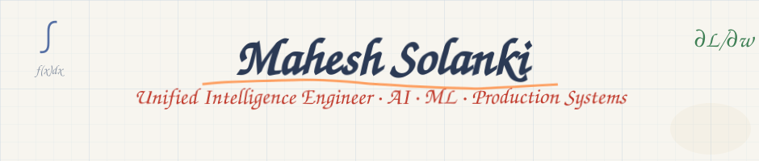
  </picture>

  

  
  
  
  

---

  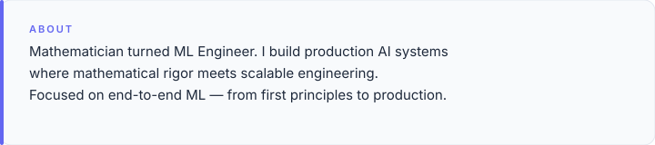

  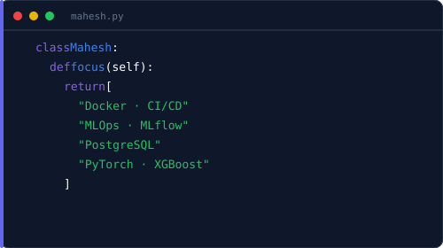

---

## 🧠 Unified Intelligence Architecture

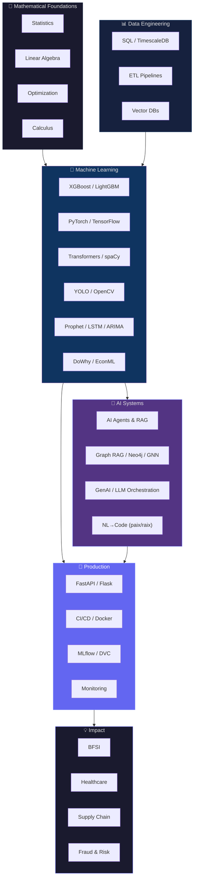
```mermaid
flowchart TB
    subgraph FOUNDATIONS["📐 Mathematical Foundations"]
        direction LR
        STAT["Statistics"]
        LA["Linear Algebra"]
        OPT["Optimization"]
        CALC["Calculus"]
    end

    subgraph DATA["📊 Data Engineering"]
        direction LR
        SQL["SQL / TimescaleDB"]
        PIPES["ETL Pipelines"]
        VECTOR["Vector DBs"]
    end

    subgraph ML["🤖 Machine Learning"]
        direction LR
        CLASSIC["XGBoost / LightGBM"]
        DL["PyTorch / TensorFlow"]
        NLP["Transformers / spaCy"]
        CV["YOLO / OpenCV"]
        TS["Prophet / LSTM / ARIMA"]
        CAUSAL["DoWhy / EconML"]
    end

    subgraph AI["🧬 AI Systems"]
        direction LR
        AGENT["AI Agents & RAG"]
        GRAPH["Graph RAG / Neo4j / GNN"]
        GENAI["GenAI / LLM Orchestration"]
        CODEGEN["NL→Code (paix/raix)"]
    end

    subgraph PROD["🚀 Production"]
        direction LR
        API["FastAPI / Flask"]
        CICD["CI/CD / Docker"]
        MLOPS["MLflow / DVC"]
        MONITOR["Monitoring"]
    end

    subgraph IMPACT["💡 Impact"]
        direction LR
        FSI["BFSI"]
        HEALTH["Healthcare"]
        SUPPLY["Supply Chain"]
        RISK["Fraud & Risk"]
    end

    FOUNDATIONS --> ML
    DATA --> ML
    ML --> AI
    ML --> PROD
    AI --> PROD
    PROD --> IMPACT

    style FOUNDATIONS fill:#1a1a2e,stroke:#16213e,color:#e0e0e0
    style DATA fill:#16213e,stroke:#0f3460,color:#e0e0e0
    style ML fill:#0f3460,stroke:#533483,color:#e0e0e0
    style AI fill:#533483,stroke:#6366F1,color:#e0e0e0
    style PROD fill:#6366F1,stroke:#818cf8,color:#fff
    style IMPACT fill:#1a1a2e,stroke:#6366F1,color:#e0e0e0
```

  
  

  

  

---

  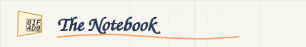

<i>math, models &amp; learning in motion</i>

  

<table align="center">
<tr>
<td width="33%" align="center">
  <b>perceptron</b> 
  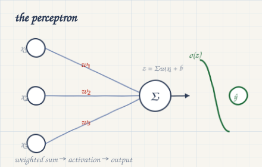
</td>
<td width="33%" align="center">
  <b>neural network — forward pass</b> 
  
</td>
<td width="33%" align="center">
  <b>backpropagation</b> 
  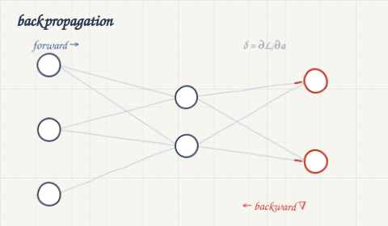
</td>
</tr>
<tr>
<td width="33%" align="center">
  <b>training loss</b> 
  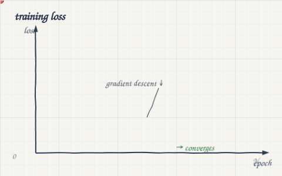
</td>
<td width="33%" align="center">
  <b>decision boundary</b> 
  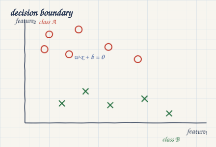
</td>
<td width="33%" align="center">
  <b>distribution</b> 
  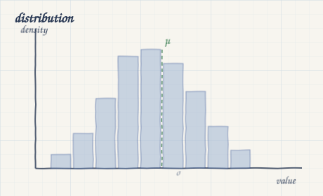
</td>
</tr>
</table>

  <b>large language model — attention mechanism</b> 
  

---

  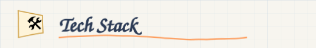

### 💻 Core Engineering

  
  
  
  
  
  
  

### 🧠 Machine Learning & AI

  
  
  
  
  
  
  

### ⚙️ MLOps & Infrastructure

  
  
  
  
  
  

### 🔬 Specialized Domains

  
  
  
  
  
  
  

---

## 📌 Pinned Projects

  
  

  
  

---

  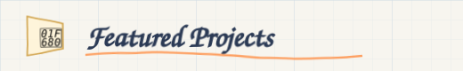

<table align="center">
<tr>
<td width="50%">
  <h3 align="center">
    <a href="https://github.com/twomathematicians-code/engineer-credit-risk">
      🏦 Credit Risk Pipeline
    </a>
  </h3>
  

    
    
    
    
  

  
End-to-end MLOps pipeline. 380+ test cases. CI/CD, Alembic migrations, model registry.

</td>
<td width="50%">
  <h3 align="center">
    <a href="https://github.com/twomathematicians-code/fraud-detection">
      🛡️ Fraud Detection Engine
    </a>
  </h3>
  

    
    
    
    
  

  
Real-time scoring. XGBoost + Isolation Forest ensemble. Sub-20ms per transaction.

</td>
</tr>
<tr>
<td width="50%">
  <h3 align="center">
    <a href="https://github.com/twomathematicians-code/CausalInference-Toolkit">
      🔬 Causal Inference Toolkit
    </a>
  </h3>
  
MSc-level statistics meets production ML. DoWhy, EconML, DAGs, counterfactuals.

</td>
<td width="50%">
  <h3 align="center">
    <a href="https://github.com/twomathematicians-code/demand-forecasting">
      📊 Demand Forecasting
    </a>
  </h3>
  
Prophet + LightGBM + SARIMA ensemble. 10% MAPE. 36-feature engineering. TimescaleDB.

</td>
</tr>
</table>

---

## 📦 Full Portfolio

### 🤖 AI/ML Infrastructure & Tools

| Project | Stack | Description |
|---|---|---|
| **[archon](https://github.com/twomathematicians-code/archon)** | YAML/DSL · Python | AI/ML Meta-Platform compiler. 6-layer architecture. Code generation, guardrails, causal ML. |
| **[raix](https://github.com/twomathematicians-code/raix)** | R · 13+ AI backends | AI assistant for RStudio. 42 functions. Chat, debug, generate code, run Python, compile C++. |
| **[paix](https://github.com/twomathematicians-code/paix)** | Python · OpenAI/Anthropic/Ollama | Natural language → executable Python code. File loading, exercise mode, 75 tests. |

### 🏭 ML Engineering & MLOps

| Project | Stack | Description |
|---|---|---|
| **[demand-forecasting](https://github.com/twomathematicians-code/demand-forecasting)** | Prophet · LightGBM · SARIMA | Production forecasting. 10% MAPE. 36 features. TimescaleDB + FastAPI + Docker. |
| **[engineer-credit-risk](https://github.com/twomathematicians-code/engineer-credit-risk)** | FastAPI · MLflow · DVC · PostgreSQL | Production ML pipeline. 380+ tests. CI/CD, Alembic, model registry. |
| **[CausalInference-Toolkit](https://github.com/twomathematicians-code/CausalInference-Toolkit)** | DoWhy · EconML · DAGs | MSc-level causal framework. Counterfactuals, A/B testing, policy evaluation. |
| **[fraud-detection](https://github.com/twomathematicians-code/fraud-detection)** | XGBoost · Isolation Forest · Redis | Real-time detection. SMOTE balancing. Sub-20ms scoring. |

### 💬 NLP & Conversational AI

| Project | Stack | Description |
|---|---|---|
| **[nlp-toolkit](https://github.com/twomathematicians-code/nlp-toolkit)** | spaCy · Transformers · FastAPI | NER, summarization, keyword extraction, language detection, translation. |
| **[chatbot-deployment](https://github.com/twomathematicians-code/chatbot-deployment)** | LangChain · ChromaDB · RAG | RAG conversational AI with Telegram + WhatsApp webhooks. |
| **[sentiment-analysis-suite](https://github.com/twomathematicians-code/sentiment-analysis-suite)** | VADER · Transformers | Emotion detection, aspect-based NLP, batch processing. |

### 📊 Analytics & BI

| Project | Stack | Description |
|---|---|---|
| **[customer-analytics](https://github.com/twomathematicians-code/customer-analytics)** | XGBoost · SHAP · RFM | Churn prediction, customer segmentation, CLV estimation. |
| **[recommender-systems](https://github.com/twomathematicians-code/recommender-systems)** | FAISS · Hybrid CF/CB · A/B | Collaborative filtering, content-based, vector search. |

### 🎯 Domain-Specific ML

| Project | Stack | Description |
|---|---|---|
| **[fingraph-sentinel](https://github.com/twomathematicians-code/fingraph-sentinel)** | Neo4j · Graph RAG · GNN · LangChain | GenAI agent for BFSI. AML, credit risk, insurance, KYC. |
| **[healthcare-analytics](https://github.com/twomathematicians-code/healthcare-analytics)** | PyTorch · HIPAA logging | Heart, cancer, diabetes, pneumonia detection. Survival analysis. |
| **[financial-forecasting](https://github.com/twomathematicians-code/financial-forecasting)** | LSTM · Prophet · ARIMA · WebSocket | Stocks, crypto, commodities. Live streaming. |
| **[computer-vision](https://github.com/twomathematicians-code/computer-vision)** | YOLO · OpenCV · FastAPI | Object detection, face recognition, segmentation, landmark detection. |

### 🎓 Academic

| Project | Description |
|---|---|
| **[bartlett-correction-sem](https://github.com/twomathematicians-code/bartlett-correction-sem)** | Bartlett correction for LRT in SEM — Master's thesis, Ghent University. Supervisor: Prof. Dr. Yves Rosseel. |
| **[mantis_optimization](https://github.com/twomathematicians-code/mantis_optimization)** | Hybrid AI optimization inspired by mantis shrimp vision. TypeScript + Next.js + Ollama. |
| **[EcoDrive-Net_finalized](https://github.com/twomathematicians-code/EcoDrive-Net_finalized)** | ADAS simulation. MATLAB + Deep Learning for eco-driving optimization. |
| **[post-quantum-computations](https://github.com/twomathematicians-code/post-quantum-computations)** | Post-quantum cryptography exploration in Python. |

---

  

---

  
  
  
  
  

---

  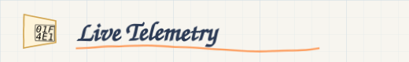

<!-- AUTO-STATS:START -->

 

| Metric | Live Value |
|:--|--:|
| Public Repositories | 32 |
| Non-Fork Projects | 32 |
| Total Stars | 1 |
| Total Forks | 0 |
| Total Watchers | 1 |
| Open Issues Across Projects | 5 |
| Open Pull Requests Tracker | 5 |
| Top Languages by Repo Count | Python (21), TeX (2), R (2), C++ (2), Jupyter Notebook (1), MATLAB (1) |
| Domain Signals | Gen AI (1), ML (5), Data (4), Deployment (2) |

#### Most Starred Repositories

| Repository | Stars | Last Push |
|:--|--:|:--|
| [Manifold-DB-Repo](https://github.com/twomathematicians-code/Manifold-DB-Repo) | 1 | 2026-06-02 |
| [twomathematicians-code](https://github.com/twomathematicians-code/twomathematicians-code) | 0 | 2026-07-30 |
| [recommender-systems](https://github.com/twomathematicians-code/recommender-systems) | 0 | 2026-07-29 |
| [nlp-toolkit](https://github.com/twomathematicians-code/nlp-toolkit) | 0 | 2026-07-29 |
| [healthcare-analytics](https://github.com/twomathematicians-code/healthcare-analytics) | 0 | 2026-07-29 |

#### Latest Updated Repositories

| Repository | Primary Language | Last Push |
|:--|:--|:--|
| [twomathematicians-code](https://github.com/twomathematicians-code/twomathematicians-code) | Python | 2026-07-30 |
| [recommender-systems](https://github.com/twomathematicians-code/recommender-systems) | Python | 2026-07-29 |
| [nlp-toolkit](https://github.com/twomathematicians-code/nlp-toolkit) | Python | 2026-07-29 |
| [healthcare-analytics](https://github.com/twomathematicians-code/healthcare-analytics) | Python | 2026-07-29 |
| [fraud-detection](https://github.com/twomathematicians-code/fraud-detection) | Python | 2026-07-29 |

> Last auto-sync: **2026-07-30 02:46 UTC**

---

  

  <samp>
    <a href="https://linkedin.com/in/maheshsolanki-16b9a6a5">linkedin</a>
    &nbsp;•&nbsp;
    <a href="mailto:maheshsinh1910@gmail.com">email</a>
    &nbsp;•&nbsp;
    <a href="https://github.com/twomathematicians-code">github</a>
  </samp>

