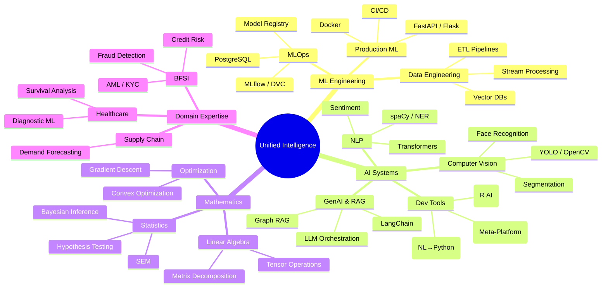
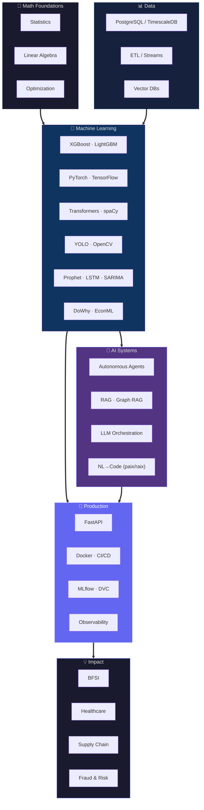
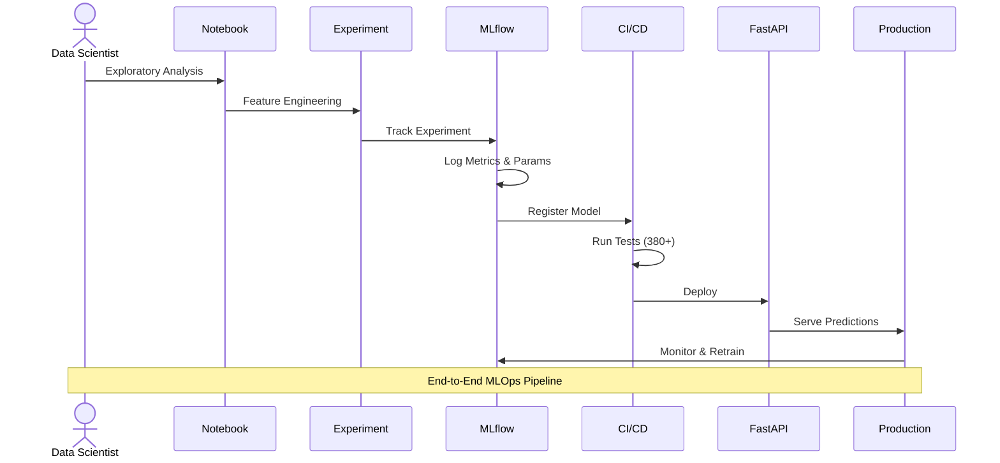

  

  

  
  
  
  

---

  

  

---

## 📊 Dashboard

  
  

  

  

---

## 🧠 Unified Intelligence

```mermaid
mindmap
  root((Unified Intelligence))
    ML Engineering
      Production ML
        FastAPI / Flask
        Docker
        CI/CD
      MLOps
        MLflow / DVC
        Model Registry
        PostgreSQL
      Data Engineering
        ETL Pipelines
        Vector DBs
        Stream Processing
    AI Systems
      GenAI & RAG
        LangChain
        Graph RAG
        LLM Orchestration
      NLP
        Transformers
        spaCy / NER
        Sentiment
      Computer Vision
        YOLO / OpenCV
        Face Recognition
        Segmentation
      Dev Tools
        paix (NL→Python)
        raix (R AI)
        Archon (Meta-Platform)
    Mathematics
      Statistics
        Bayesian Inference
        Hypothesis Testing
        SEM
      Optimization
        Gradient Descent
        Convex Optimization
      Linear Algebra
        Matrix Decomposition
        Tensor Operations
    Domain Expertise
      BFSI
        Credit Risk
        Fraud Detection
        AML / KYC
      Healthcare
        Diagnostic ML
        Survival Analysis
      Supply Chain
        Demand Forecasting
```

```mermaid
flowchart TB
    subgraph FOUND["📐 Math Foundations"]
        STAT["Statistics"]
        LA["Linear Algebra"]
        OPT["Optimization"]
    end

    subgraph DATA["📊 Data"]
        SQL["PostgreSQL / TimescaleDB"]
        PIPES["ETL / Streams"]
        VECTOR["Vector DBs"]
    end

    subgraph ML["🤖 Machine Learning"]
        CLASSIC["XGBoost · LightGBM"]
        DL["PyTorch · TensorFlow"]
        NLP["Transformers · spaCy"]
        CV["YOLO · OpenCV"]
        TS["Prophet · LSTM · SARIMA"]
        CAUSAL["DoWhy · EconML"]
    end

    subgraph AI["🧬 AI Systems"]
        AGENT["Autonomous Agents"]
        RAG["RAG · Graph RAG"]
        LLM["LLM Orchestration"]
        CODEGEN["NL→Code (paix/raix)"]
    end

    subgraph PROD["🚀 Production"]
        API["FastAPI"]
        CICD["Docker · CI/CD"]
        MLOPS["MLflow · DVC"]
        MONITOR["Observability"]
    end

    subgraph IMPACT["💡 Impact"]
        FSI["BFSI"]
        HEALTH["Healthcare"]
        SUPPLY["Supply Chain"]
        RISK["Fraud & Risk"]
    end

    FOUND ==> ML
    DATA ==> ML
    ML ==> AI
    ML ==> PROD
    AI ==> PROD
    PROD ==> IMPACT

    style FOUND fill:#1a1a2e,stroke:#16213e,color:#e0e0e0
    style DATA fill:#16213e,stroke:#0f3460,color:#e0e0e0
    style ML fill:#0f3460,stroke:#533483,color:#e0e0e0
    style AI fill:#533483,stroke:#6366F1,color:#e0e0e0
    style PROD fill:#6366F1,stroke:#818cf8,color:#fff
    style IMPACT fill:#1a1a2e,stroke:#6366F1,color:#e0e0e0
```

```mermaid
sequenceDiagram
    actor DS as Data Scientist
    participant NB as Notebook
    participant EXP as Experiment
    participant MLF as MLflow
    participant CD as CI/CD
    participant API as FastAPI
    participant PROD as Production

    DS->>NB: Exploratory Analysis
    NB->>EXP: Feature Engineering
    EXP->>MLF: Track Experiment
    MLF->>MLF: Log Metrics & Params
    MLF->>CD: Register Model
    CD->>CD: Run Tests (380+)
    CD->>API: Deploy
    API->>PROD: Serve Predictions
    PROD->>MLF: Monitor & Retrain
    Note over DS,PROD: End-to-End MLOps Pipeline
```

---

## 📓 Notebook

<i>math, models &amp; learning in motion</i>

  <table>
  <tr>
    <td width="48%" align="center">
      
    </td>
    <td width="48%" align="center">
      
    </td>
  </tr>
  </table>

---

## 🚀 Featured Projects

  
  

  
  

---

## 📁 Portfolio

### 🤖 AI/ML Infrastructure & Tools

| Project | Stack | Description |
|---|---|---|
| **[archon](https://github.com/twomathematicians-code/archon)** | YAML/DSL · Python · 6-layer | AI/ML Meta-Platform. Intent compiler, code generation, guardrails, GenAI, causal ML. |
| **[raix](https://github.com/twomathematicians-code/raix)** | R · 13+ AI backends · 42 fns | AI coding assistant for RStudio. Self-configuring dashboard. |
| **[paix](https://github.com/twomathematicians-code/paix)** | Python · OpenAI/Anthropic/Ollama | NL → executable Python code. File loading, exercise mode, 75 tests. |

### 🏭 ML Engineering & MLOps

| Project | Stack | Highlights |
|---|---|---|
| **[engineer-credit-risk](https://github.com/twomathematicians-code/engineer-credit-risk)** | FastAPI · MLflow · DVC · PostgreSQL | 380+ tests · CI/CD · Alembic · Model Registry |
| **[fraud-detection](https://github.com/twomathematicians-code/fraud-detection)** | XGBoost · Isolation Forest · Redis | &lt;20ms · SMOTE · Real-time scoring |
| **[demand-forecasting](https://github.com/twomathematicians-code/demand-forecasting)** | Prophet · LightGBM · SARIMA | 10% MAPE · 36 features · TimescaleDB · FastAPI |
| **[CausalInference-Toolkit](https://github.com/twomathematicians-code/CausalInference-Toolkit)** | DoWhy · EconML · DAGs | Counterfactuals · Policy evaluation · A/B testing |

### 💬 NLP & Conversational AI

| Project | Stack | Description |
|---|---|---|
| **[nlp-toolkit](https://github.com/twomathematicians-code/nlp-toolkit)** | spaCy · Transformers · FastAPI | NER, summarization, keyword extraction, translation. |
| **[chatbot-deployment](https://github.com/twomathematicians-code/chatbot-deployment)** | LangChain · ChromaDB · RAG | RAG conversational AI with Telegram + WhatsApp webhooks. |
| **[sentiment-analysis-suite](https://github.com/twomathematicians-code/sentiment-analysis-suite)** | VADER · Transformers | Emotion detection, aspect-based NLP, batch processing. |

### 📊 Analytics & BI

| Project | Stack | Description |
|---|---|---|
| **[customer-analytics](https://github.com/twomathematicians-code/customer-analytics)** | XGBoost · SHAP · RFM | Churn prediction, segmentation, CLV estimation. |
| **[recommender-systems](https://github.com/twomathematicians-code/recommender-systems)** | FAISS · Hybrid CF/CB · A/B | Collaborative filtering, content-based, vector search. |

### 🎯 Domain-Specific ML

| Project | Stack | Domain |
|---|---|---|
| **[fingraph-sentinel](https://github.com/twomathematicians-code/fingraph-sentinel)** | Neo4j · Graph RAG · GNN · LangChain | BFSI: AML · credit · insurance · KYC |
| **[healthcare-analytics](https://github.com/twomathematicians-code/healthcare-analytics)** | PyTorch · HIPAA logging | Heart · cancer · diabetes · pneumonia |
| **[financial-forecasting](https://github.com/twomathematicians-code/financial-forecasting)** | LSTM · Prophet · ARIMA · WebSocket | Stocks · crypto · commodities |
| **[computer-vision](https://github.com/twomathematicians-code/computer-vision)** | YOLO · OpenCV · FastAPI | Detection · face · segmentation · landmarks |

### 🎓 Academic & Research

| Project | Stack | Description |
|---|---|---|
| **[bartlett-correction-sem](https://github.com/twomathematicians-code/bartlett-correction-sem)** | R · SEM · lavaan | Bartlett correction for LRT in SEM. MSc thesis, Ghent University. |
| **[mantis_optimization](https://github.com/twomathematicians-code/mantis_optimization)** | TypeScript · Next.js · Ollama | AI optimization inspired by mantis shrimp vision. |
| **[EcoDrive-Net_finalized](https://github.com/twomathematicians-code/EcoDrive-Net_finalized)** | MATLAB · Deep Learning | ADAS eco-driving simulation. |
| **[post-quantum-computations](https://github.com/twomathematicians-code/post-quantum-computations)** | Python · Cryptography | Post-quantum cryptography exploration. |
| **[chen](https://github.com/twomathematicians-code/chen)** | Python · Distributed AI | CHEN theory — distributed AI research. |

  

---

  <samp>
    <a href="https://linkedin.com/in/maheshsolanki-16b9a6a5">linkedin</a>
    &nbsp;·&nbsp;
    <a href="mailto:maheshsinh1910@gmail.com">email</a>
    &nbsp;·&nbsp;
    <a href="https://github.com/twomathematicians-code">github</a>
  </samp>

