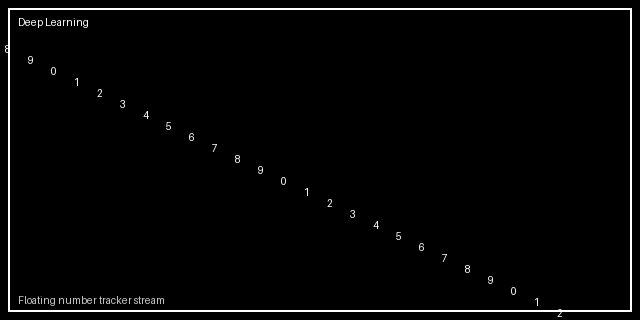
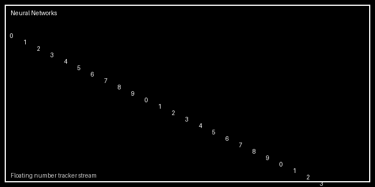

<p align="center">
  
</p>

<p align="center">
  
</p>

<p align="center">
  <a href="https://linkedin.com/in/maheshsolanki-16b9a6a5"></a>
  <a href="mailto:maheshsinh1910@gmail.com"></a>
  <a href="https://github.com/twomathematicians-code"></a>
  
</p>

---

<table align="center">
<tr>
<td width="45%">

```yaml
┌─────────────────────────────────┐
│  🧠  NEURAL  CORE               │
└─────────────────────────────────┘

  engine    : Python • R • SQL • MATLAB
  ml        : PyTorch • XGBoost • scikit-learn
  mldev     : MLflow • DVC • HuggingFace
  infra     : Docker • FastAPI • PostgreSQL
  bigdata   : PySpark • ETL Pipelines
  viz       : Tableau • Power BI • Plotly
  devops    : Git • GitHub Actions • Linux
  research  : Causal ML • DL • SEM • Crypto
```

</td>
<td width="55%">


</td>
</tr>
</table>

---

## ⚡ Tech Stack

<p align="center">
  <a href="https://skillicons.dev">
    
  </a>
</p>
<p align="center">
  <a href="https://skillicons.dev">
    
  </a>
</p>
<p align="center">
  <a href="https://skillicons.dev/icons?i=latex,vscode,anaconda,stackoverflow,regex,powershell&theme=dark&perline=6" />
  </a>
</p>

---

## 📈 Contribution Pulse

<p align="center">
  
</p>

---

## 🚀 Featured Projects

<table align="center">
<tr>
<td width="50%">
  <h3 align="center">
    <a href="https://github.com/twomathematicians-code/ml-engineer-credit-risk">
      🏦 ML Credit Risk API
    </a>
  </h3>
  <p align="center">
    Production ML pipeline — FastAPI • PostgreSQL • Docker • CI/CD • MLflow • DVC
  </p>
  <p align="center">
    
    
    
    
  </p>
</td>
<td width="50%">
  <h3 align="center">
    <a href="https://github.com/twomathematicians-code/EcoDrive-Net_finalized">
      🚗 EcoDrive-Net ADAS
    </a>
  </h3>
  <p align="center">
    Edge-vision ADAS — lane detection • vehicle ranging • predictive TTC
  </p>
  <p align="center">
    
    
    
    
  </p>
</td>
</tr>
<tr>
<td width="50%">
  <h3 align="center">
    <a href="https://github.com/twomathematicians-code/Manifold-DB-Repo">
      🔢 Manifold DB
    </a>
  </h3>
  <p align="center">
    Numerical methods & manifold computations — Python & C++
  </p>
  <p align="center">
    
    
    
  </p>
</td>
<td width="50%">
  <h3 align="center">
    <a href="https://github.com/twomathematicians-code/mantis_optimization">
      🤖 Hybrid AI Optimizer
    </a>
  </h3>
  <p align="center">
    Local-first + Cloud AI — 5 architecture patterns for cost optimization
  </p>
  <p align="center">
    
    
    
    
  </p>
</td>
</tr>
</table>

<details>
<summary><b>🔭 Explore All Projects (10+)</b></summary>
<br/>
<table>
<tr>
  <td width="33%"><a href="https://github.com/twomathematicians-code/bartlett-correction-sem"><b>Bartlett Correction SEM</b></a><br/><sub>R • lavaan • Monte Carlo • Statistics</sub></td>
  <td width="33%"><a href="https://github.com/twomathematicians-code/post-quantum-computations"><b>Post-Quantum Cryptography</b></a><br/><sub>Python • Cryptography • Research</sub></td>
  <td width="33%"><a href="https://github.com/twomathematicians-code/maisuclaw"><b>MAISUCLAW Agent Swarm</b></a><br/><sub>Python • 7 LLM Providers • Auto-Failover</sub></td>
</tr>
<tr>
  <td><a href="https://github.com/twomathematicians-code/multi-lang-viz-repo"><b>Multi-Language Viz</b></a><br/><sub>Python • R • MATLAB • D3.js</sub></td>
  <td><a href="https://github.com/twomathematicians-code/interactive-visualizations-demo"><b>Interactive Viz Demo</b></a><br/><sub>D3.js • React • Data Viz</sub></td>
  <td><a href="https://github.com/twomathematicians-code/python-calculus-analysis"><b>Python Calculus Analysis</b></a><br/><sub>Python • Calculus • NumPy • SciPy</sub></td>
</tr>
<tr>
  <td><a href="https://github.com/twomathematicians-code/ollama-rstudio-assistant"><b>Ollama RStudio Assistant</b></a><br/><sub>R • Ollama • LLM • IDE Plugin</sub></td>
  <td><a href="https://github.com/twomathematicians-code/chen"><b>Chen Theory</b></a><br/><sub>Python • Mathematics • Research</sub></td>
  <td><a href="https://github.com/twomathematicians-code/mahesh-portfolio"><b>Portfolio</b></a><br/><sub>Jupyter • Data Science • Showcase</sub></td>
</tr>
</table>
</details>

---

## ⚙️ Live Repo Telemetry

<!-- AUTO-STATS:START -->
<p align="center"> </p>

| Metric | Live Value |
|:--|--:|
| Public Repositories | 22 |
| Non-Fork Projects | 22 |
| Total Stars | 1 |
| Total Forks | 0 |
| Total Watchers | 1 |
| Open Issues Across Projects | 5 |
| Open Pull Requests Tracker | 5 |
| Top Languages by Repo Count | Python (11), TeX (2), R (2), C++ (2), Jupyter Notebook (1), MATLAB (1) |
| Domain Signals | Gen AI (0), ML (2), Data (1), Deployment (0) |

#### Most Starred Repositories

| Repository | Stars | Last Push |
|:--|--:|:--|
| [Manifold-DB-Repo](https://github.com/twomathematicians-code/Manifold-DB-Repo) | 1 | 2026-06-02 |
| [twomathematicians-code](https://github.com/twomathematicians-code/twomathematicians-code) | 0 | 2026-07-29 |
| [ml-engineer-credit-risk](https://github.com/twomathematicians-code/ml-engineer-credit-risk) | 0 | 2026-07-29 |
| [bartlett-correction-sem](https://github.com/twomathematicians-code/bartlett-correction-sem) | 0 | 2026-07-29 |
| [chen](https://github.com/twomathematicians-code/chen) | 0 | 2026-07-19 |

#### Latest Updated Repositories

| Repository | Primary Language | Last Push |
|:--|:--|:--|
| [twomathematicians-code](https://github.com/twomathematicians-code/twomathematicians-code) | Python | 2026-07-29 |
| [ml-engineer-credit-risk](https://github.com/twomathematicians-code/ml-engineer-credit-risk) | Python | 2026-07-29 |
| [bartlett-correction-sem](https://github.com/twomathematicians-code/bartlett-correction-sem) | TeX | 2026-07-29 |
| [chen](https://github.com/twomathematicians-code/chen) | Python | 2026-07-19 |
| [mahesh-portfolio](https://github.com/twomathematicians-code/mahesh-portfolio) | Jupyter Notebook | 2026-07-15 |

> Last auto-sync: **2026-07-29 09:18 UTC**

#### Deep Learning & Neural Networks Number Streams

<p align="center"> </p>

> Powered by `/scripts/update_profile_readme.py` and GitHub Actions for @twomathematicians-code.
<!-- AUTO-STATS:END -->

---

<p align="center">
  
</p>

<p align="center">
  
</p>

<p align="center">
  <samp>
    <a href="https://linkedin.com/in/maheshsolanki-16b9a6a5">linkedin</a> •
    <a href="mailto:maheshsinh1910@gmail.com">email</a> •
    <a href="https://github.com/twomathematicians-code">github</a>
  </samp>
</p>


