<!-- AUTO-GENERATED-START -->

  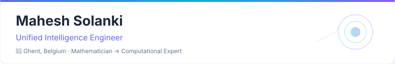

  

  
  
  
  

---

  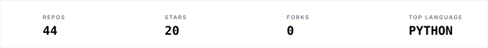

  <table>
    <tr>
      <td width="48%" align="center">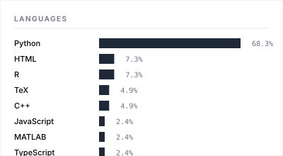</td>
      <td width="48%" align="center"></td>
    </tr>
  </table>

  <table>
    <tr>
      <td width="48%" align="center"></td>
      <td width="48%" align="center"></td>
    </tr>
  </table>

  

---

## 🧠 Unified Intelligence

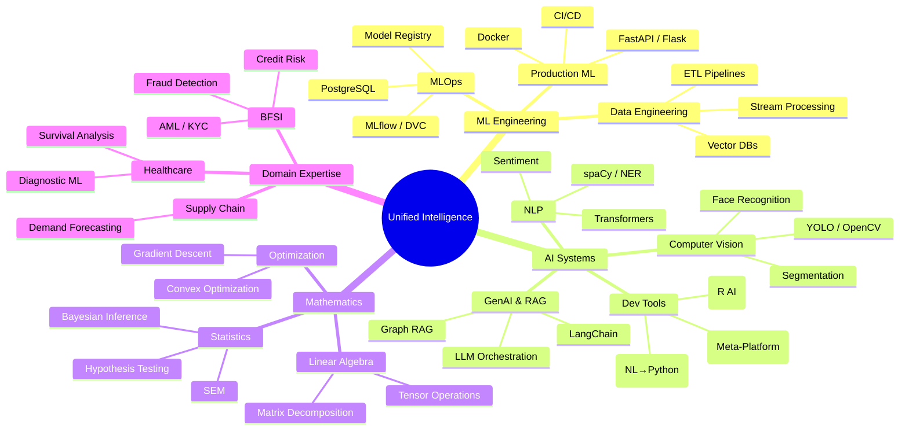
```mermaid
mindmap
  root((Unified Intelligence))
    ML Engineering
      Production ML
        FastAPI / Flask
        Docker
        CI/CD
      MLOps
        MLflow / DVC
        Model Registry
        PostgreSQL
      Data Engineering
        ETL Pipelines
        Vector DBs
        Stream Processing
    AI Systems
      GenAI & RAG
        LangChain
        Graph RAG
        LLM Orchestration
      NLP
        Transformers
        spaCy / NER
        Sentiment
      Computer Vision
        YOLO / OpenCV
        Face Recognition
        Segmentation
      Dev Tools
        paix (NL→Python)
        raix (R AI)
        Archon (Meta-Platform)
    Mathematics
      Statistics
        Bayesian Inference
        Hypothesis Testing
        SEM
      Optimization
        Gradient Descent
        Convex Optimization
      Linear Algebra
        Matrix Decomposition
        Tensor Operations
    Domain Expertise
      BFSI
        Credit Risk
        Fraud Detection
        AML / KYC
      Healthcare
        Diagnostic ML
        Survival Analysis
      Supply Chain
        Demand Forecasting
```

---

## 🚀 Featured Projects

  <table>
    <tr>
      <td width="48%" align="center"></td>
      <td width="48%" align="center"></td>
    </tr>
    <tr>
      <td width="48%" align="center"></td>
      <td width="48%" align="center"></td>
    </tr>
  </table>

---

## 📦 Repository Components

> Each repository is a unique SVG component, auto-generated from live GitHub data.

  

  <table>
    <tr>
      <td width="48%" align="center"><a href="https://github.com/twomathematicians-code/archon">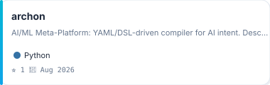</a></td>
      <td width="48%" align="center"><a href="https://github.com/twomathematicians-code/raix">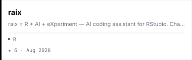</a></td>
    </tr>
    <tr>
      <td width="48%" align="center"></td>
    </tr>
  </table>

  

  <table>
    <tr>
      <td width="48%" align="center"><a href="https://github.com/twomathematicians-code/demand-forecasting">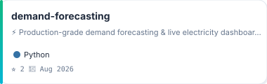</a></td>
      <td width="48%" align="center"></td>
    </tr>
    <tr>
      <td width="48%" align="center"></td>
      <td width="48%" align="center"><a href="https://github.com/twomathematicians-code/engineer-credit-risk">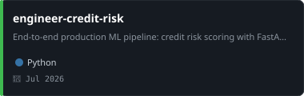</a></td>
    </tr>
    <tr>
      <td width="48%" align="center"></td>
    </tr>
  </table>

  

  <table>
    <tr>
      <td width="48%" align="center"><a href="https://github.com/twomathematicians-code/nlp-toolkit">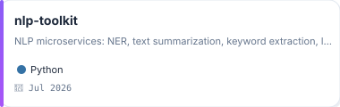</a></td>
      <td width="48%" align="center"><a href="https://github.com/twomathematicians-code/chatbot-deployment">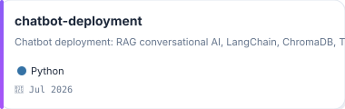</a></td>
    </tr>
    <tr>
      <td width="48%" align="center"><a href="https://github.com/twomathematicians-code/sentiment-analysis-suite">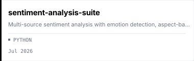</a></td>
      <td width="48%" align="center"><a href="https://github.com/twomathematicians-code/chen">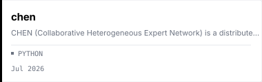</a></td>
    </tr>
  </table>

  

  <table>
    <tr>
      <td width="48%" align="center"></td>
      <td width="48%" align="center"><a href="https://github.com/twomathematicians-code/recommender-systems">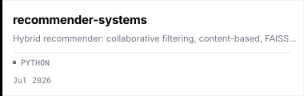</a></td>
    </tr>
    <tr>
      <td width="48%" align="center"><a href="https://github.com/twomathematicians-code/EP_Analytics">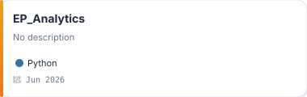</a></td>
    </tr>
  </table>

  

  <table>
    <tr>
      <td width="48%" align="center"><a href="https://github.com/twomathematicians-code/fingraph-sentinel">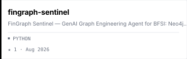</a></td>
      <td width="48%" align="center"><a href="https://github.com/twomathematicians-code/healthcare-analytics">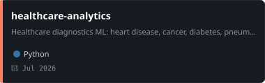</a></td>
    </tr>
    <tr>
      <td width="48%" align="center"></td>
      <td width="48%" align="center"><a href="https://github.com/twomathematicians-code/computer-vision">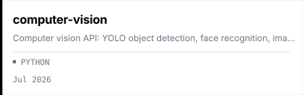</a></td>
    </tr>
  </table>

  

  <table>
    <tr>
      <td width="48%" align="center"><a href="https://github.com/twomathematicians-code/ViVAE-Research-Project">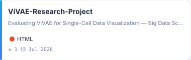</a></td>
      <td width="48%" align="center"></td>
    </tr>
    <tr>
      <td width="48%" align="center"><a href="https://github.com/twomathematicians-code/mahesh-portfolio">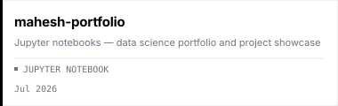</a></td>
      <td width="48%" align="center"></td>
    </tr>
  </table>

  

  <table>
    <tr>
      <td width="48%" align="center"><a href="https://github.com/twomathematicians-code/AgentForge">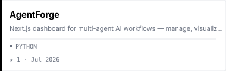</a></td>
      <td width="48%" align="center"></td>
    </tr>
    <tr>
      <td width="48%" align="center"><a href="https://github.com/twomathematicians-code/ollama-rstudio-assistant">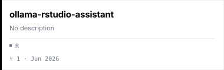</a></td>
      <td width="48%" align="center"></td>
    </tr>
  </table>

  

  <table>
    <tr>
      <td width="48%" align="center"></td>
      <td width="48%" align="center"><a href="https://github.com/twomathematicians-code/Python-Advanced-Calculus-Analysis">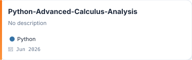</a></td>
    </tr>
    <tr>
      <td width="48%" align="center"><a href="https://github.com/twomathematicians-code/python_numerical_methods">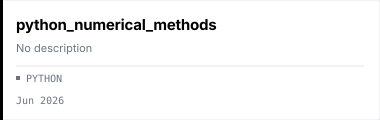</a></td>
      <td width="48%" align="center"><a href="https://github.com/twomathematicians-code/ccp_numerical_methods">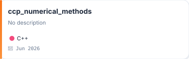</a></td>
    </tr>
    <tr>
      <td width="48%" align="center"><a href="https://github.com/twomathematicians-code/matric-space">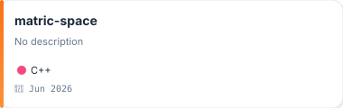</a></td>
    </tr>
  </table>

  

  <table>
    <tr>
      <td width="48%" align="center"><a href="https://github.com/twomathematicians-code/Hybrid_Game_Recommendation">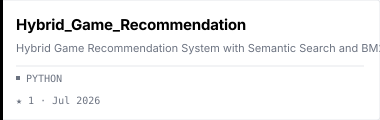</a></td>
      <td width="48%" align="center"><a href="https://github.com/twomathematicians-code/Mind-Not-Brain">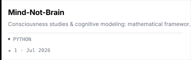</a></td>
    </tr>
    <tr>
      <td width="48%" align="center"></td>
      <td width="48%" align="center"></td>
    </tr>
    <tr>
      <td width="48%" align="center"><a href="https://github.com/twomathematicians-code/Final_SEMLRT">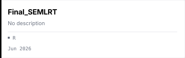</a></td>
      <td width="48%" align="center"><a href="https://github.com/twomathematicians-code/mantis_optimization">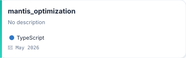</a></td>
    </tr>
    <tr>
      <td width="48%" align="center"><a href="https://github.com/twomathematicians-code/maisuclaw">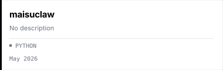</a></td>
      <td width="48%" align="center"><a href="https://github.com/twomathematicians-code/agnblue-vyakarana">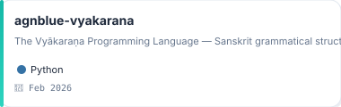</a></td>
    </tr>
  </table>

---

## 🔧 Tech Pipeline

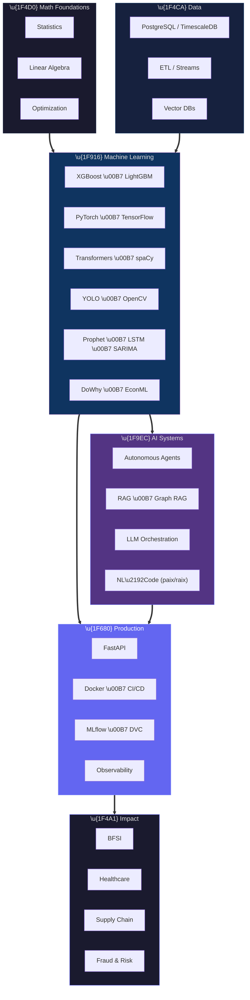
```mermaid
flowchart TB
    subgraph FOUND["\u{1F4D0} Math Foundations"]
        STAT["Statistics"]
        LA["Linear Algebra"]
        OPT["Optimization"]
    end

    subgraph DATA["\u{1F4CA} Data"]
        SQL["PostgreSQL / TimescaleDB"]
        PIPES["ETL / Streams"]
        VECTOR["Vector DBs"]
    end

    subgraph ML["\u{1F916} Machine Learning"]
        CLASSIC["XGBoost \u00B7 LightGBM"]
        DL["PyTorch \u00B7 TensorFlow"]
        NLP["Transformers \u00B7 spaCy"]
        CV["YOLO \u00B7 OpenCV"]
        TS["Prophet \u00B7 LSTM \u00B7 SARIMA"]
        CAUSAL["DoWhy \u00B7 EconML"]
    end

    subgraph AI["\u{1F9EC} AI Systems"]
        AGENT["Autonomous Agents"]
        RAG["RAG \u00B7 Graph RAG"]
        LLM["LLM Orchestration"]
        CODEGEN["NL\u2192Code (paix/raix)"]
    end

    subgraph PROD["\u{1F680} Production"]
        API["FastAPI"]
        CICD["Docker \u00B7 CI/CD"]
        MLOPS["MLflow \u00B7 DVC"]
        MONITOR["Observability"]
    end

    subgraph IMPACT["\u{1F4A1} Impact"]
        FSI["BFSI"]
        HEALTH["Healthcare"]
        SUPPLY["Supply Chain"]
        RISK["Fraud & Risk"]
    end

    FOUND ==> ML
    DATA ==> ML
    ML ==> AI
    ML ==> PROD
    AI ==> PROD
    PROD ==> IMPACT

    style FOUND fill:#1a1a2e,stroke:#16213e,color:#e0e0e0
    style DATA fill:#16213e,stroke:#0f3460,color:#e0e0e0
    style ML fill:#0f3460,stroke:#533483,color:#e0e0e0
    style AI fill:#533483,stroke:#6366f1,color:#e0e0e0
    style PROD fill:#6366f1,stroke:#818cf8,color:#fff
    style IMPACT fill:#1a1a2e,stroke:#6366f1,color:#e0e0e0
```

---

  

  <samp>
    <a href="https://linkedin.com/in/maheshsolanki-16b9a6a5" style="color:#c9d1d9">linkedin</a>
    &nbsp;·&nbsp;
    <a href="mailto:maheshsinh1910@gmail.com" style="color:#c9d1d9">email</a>
    &nbsp;·&nbsp;
    <a href="https://github.com/twomathematicians-code" style="color:#c9d1d9">github</a>
  </samp>

<!-- AUTO-GENERATED-END -->